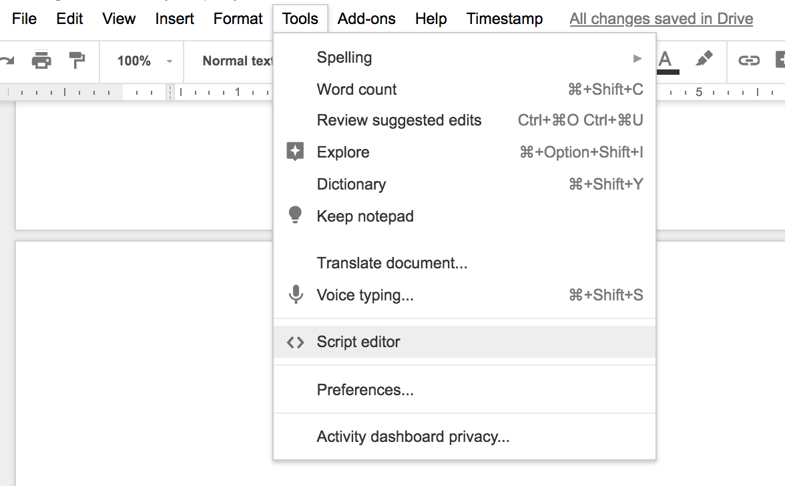
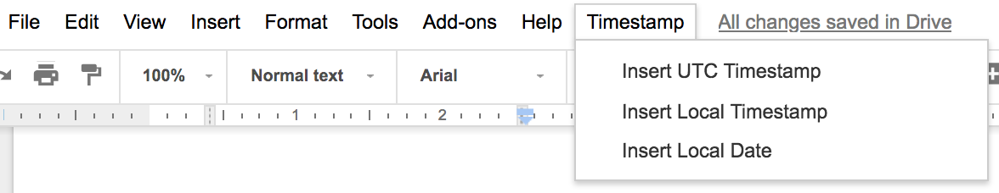

# Google-Apps-Script
scrips for google docs

## How it works
Open Google Docs Script editor page
`Tools -> Script editor`
```

```


```
Copy script text into the editor page
Save and close editor page
Refresh Google Docs
Timestamp option available 

```

```

```
## Scripts
`timestamp_docs.gs`
script creates timestamps in Google Docs